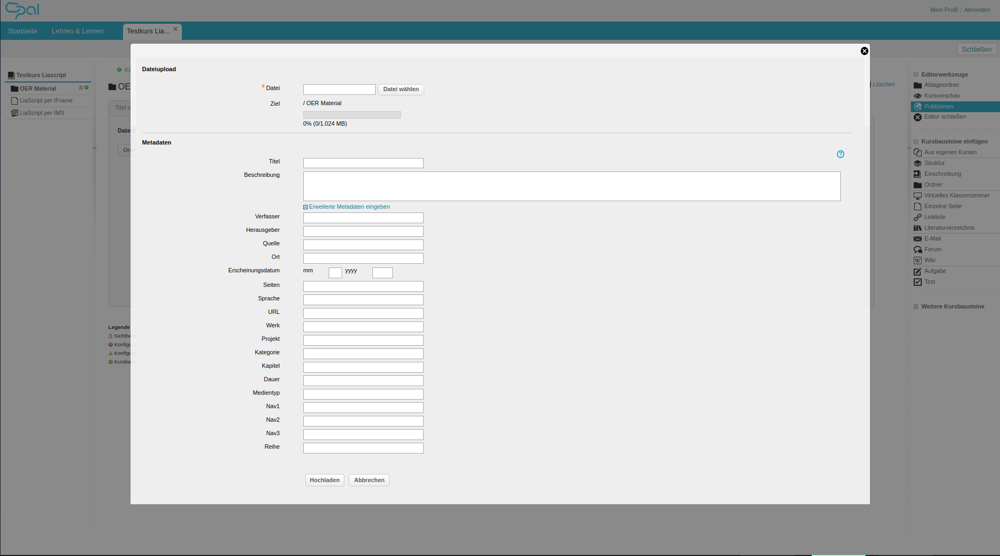
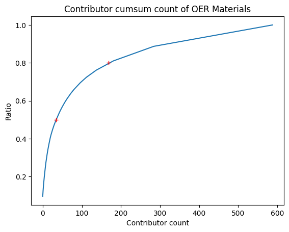
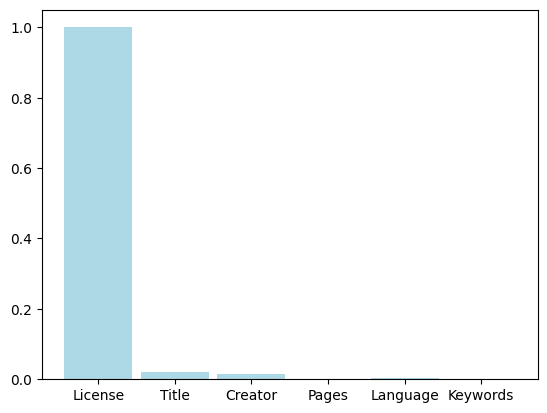
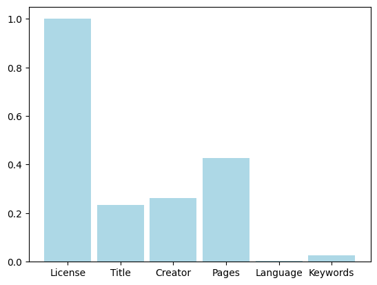

<!--
author:   Sebastian Zug, André Dietrich

email:    Sebastian.Zug@informatik.tu-freiberg.de

version:  0.0.1

language: de

narrator: Deutsch Male

mode:     Presentation

comment:  Dieser Kurs für in das Projekt LiaScript ein und diskutiert die
          Vorteile im Kontext der OER Idee.

link:     https://cdn.jsdelivr.net/chartist.js/latest/chartist.min.css

script:   https://cdn.jsdelivr.net/chartist.js/latest/chartist.min.js

logo:     ./images/logo.png

import: https://raw.githubusercontent.com/LiaTemplates/Rextester/master/README.md
        https://raw.githubusercontent.com/liaTemplates/processingjs/master/README.md

translation: Deutsch  translations/German.md

-->

# OER mit OPAL 
<h2>Eine kritische Bestandsaufnahme </h2>

<!-- style="width: 50%;" -->

| Mitwirkende             | Herkunft                                                         | Email                                                                                       |
|-------------------------|------------------------------------------------------------------|---------------------------------------------------------------------------------------------|
| Prof. Dr. Sebastian Zug | TU Bergakademie Freiberg, Fakultät für Mathematik und Informatik | [sebastian.zug@informatik.tu-freiberg.de](mailto:sebastian.zug@informatik.tu-freiberg.de)   |
| Dr. André Dietrich      |                                                                  | [Andre.Dietrich@informatik.tu-freiberg.de](mailto:Andre.Dietrich@informatik.tu-freiberg.de) |
| Johann Schwarze         |                                                                  |                                                                                             |
| Oliver Löwe             | TU Bergakademie Freiberg, Universitätsbibliothek                 | [Oliver.Loewe@ub.tu-freiberg.de](mailto:Oliver.Loewe@ub.tu-freiberg.de)                     |

Diese Präsentation beschreibt erste Ergebnisse einer Analyse der _Open Educational Ressources_ Datenbestände im sächsischen Lernmanagementsystem OPAL. Der Beitrag wurde im Rahmen der [Show & Tell Session des HDS.Forums](https://www.hd-sachsen.de/tagungen/hdsforum-dhsfachtag) am 9. November 2022 vorgestellt.

_ Der Quellcode kann des Open Source Dokuments ist unter [Link](https://github.com/SebastianZug/WillkommenAufLiaScript/blob/master/HDS.Forum.md) zu finden._

## OER Vision

>  **Open Courseware / Open Educational Resources** ... teaching, learning and
> research materials in any medium, digital or otherwise,that reside in the
> **public domain** or have been released under an open license that permits
> no-cost access, use, **adaptation** and **redistribution** by others with no or 4
> limited restrictions. Open licensing is built within the existing framework of
> intellectual property rights as defined by relevant international conventions
> and respects the authorship of the work
>
> -- UNESCO 2002 Forum on the Impact of Open Courseware for Higher Education in Developing Countries [(Link)](https://unesdoc.unesco.org/ark:/48223/pf0000128515)

| Anforderung                  | Bedeutung                                  |
|------------------------------|--------------------------------------------|
| `verwahren/vervielfältigen ` | Download, Speicherung und Vervielfältigung |
| `verwenden`                  | Nutzung im Lernkontext                     |
| `verarbeiten`                | Umgestaltung und Adaption                  |
| `vermischen`                 | Kombination und Extraktion                 |
| `verbreiten`                 | (digitale) Publikation                     |

*_5 V-Freiheiten für Offenheit_ von Jöran Muuß-Merholz und Jörg Lohrer für [open-educational-ressources](https://open-educational-resources.de) - Transferstelle für OER*

> _OER können der Auslöser für Innovation und neue Lenrformen des 21. Jahrhunderts sein._
>
> -- _Handreichung OER - Der Einstieg in den Umgang mit Open Educational Ressources_, Bericht des Projektes OERsax, 2018

## OER in OPAL ...

Anderen Kursmaterialien zur Verfügung zu stellen, ist in OPAL auf zwei Wegen möglich:

+ für ganze Kurse (3828 Einträge)

+ für einzelne Dateien (11322 Einträge)

> Die OPAL OER Materialien werden in den Bestand der sächsischen Universitätsbibliotheken gespiegelt.

### Ergebnis 1: Materialform

<!-- data-show
data-type="BarChart"
data-title="Anteil der Datenformate im Kontext der OPAL OER Dateien"
data-xlabel="Datentyp"
data-ylabel="% of Anzahl" -->
| Dateityp | Anzahl | ratio    |
|----------|--------|----------|
| `pdf`    | 5242   | 0.494995 |
| `jpg`    | 1040   | 0.098206 |
| `mkv`    | 873    | 0.082436 |
| `mp4`    | 586    | 0.055335 |
| `png`    | 494    | 0.046648 |
| `zip`    | 443    | 0.041832 |
| `html`   | 387    | 0.036544 |
| `docx`   | 376    | 0.035505 |
| `pptx`   | 245    | 0.023135 |
| `xlsx`   | 191    | 0.018036 |

> Die Materialien im OPAL kommen überwiegend geschlossenes Dateiformat daher. Eine Wiederverwendung ist entsprechend nur schwer möglich.

> Ein kleiner Anteil der Dateien ist passwortgeschützt!

### Ergebnis 2: Autoren

> Nur ein kleiner Teil der sächsischen Hochschullehrer:innen bringt in sich in die Lehre anhand von OER Materialien ein - 34 Autor:innen generieren die Hälfte der Inhalte.

### Ergebnis 3: Vollständigkeit der Metainformtionen

> Die fehlenden bzw. falschen Metadaten sind ein zentrales Hemmnis für die Auffindbarkeit.

## Potential und Projektziele

1. "Kulturell" 

   - Steigerung der Sichtbarkeit von OER im Hochschulalltag 
   - Entwicklung einer OER Community
   - Erprobung des Einsatzes von OER in der eigenen Lehre

2. "IT-seitig" 

   - Entwicklung und Evaluation neuer Konzepte für OER Materialien ([LiaScript](https://liascript.github.io/))
   - Maschinelle Extraktion essentieller Meta-Informationen

> **Neugierig geworden auf weitere Ergebnisse oder Ideen zur weiteren Interpretation? Sprechen Sie uns an!**